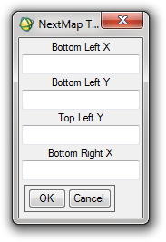
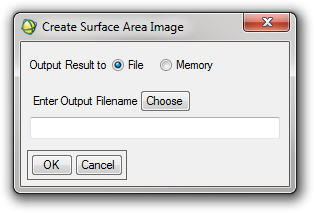
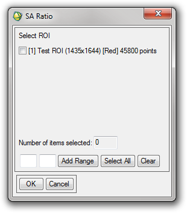

Tools: DEMs
-----------

Select NeXTMap tiles
^^^^^^^^^^^^^^^^^^^^

Selects the DEM tiles from the NeXTMap project (NEODC, 2009) which are needed to cover an image. Can take an input from either a georeferenced image, a set of corner co-ordinates for an image, or the bottom left co-ordinates and length/width of an image.

Input
.....

Image co-ordinates (from one of the above options)

Output
......

List of NeXTMap tiles needed to cover the image.

Calculate Surface Area
^^^^^^^^^^^^^^^^^^^^^^

Calculates an estimate of the 3D surface area of a DEM using the Jenness (2004) method.

Input
.....

DEM with associated map information including pixel size

Output
......

New image band containing a ‘surface area image’ (similar to the slope and azimuth images created by the ENVI Topographic Modelling command) where the value of each pixel is the surface area of that pixel.

Calculate Surface Area Ratio
^^^^^^^^^^^^^^^^^^^^^^^^^^^^

Calculates the ratio of 3D surface area to planimetric surface area, which is useful for estimating the topographic roughness of an area.

Input
.....

* Surface Area image
* One or more ROIs

Output
......

Table showing the ratio for each of the selected ROIs