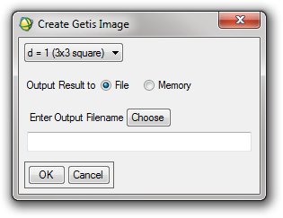
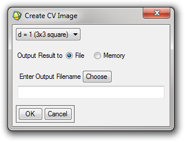

Tools: Local Indicators of Spatial Autocorrelation
--------------------------------------------------

Create Getis Image
^^^^^^^^^^^^^^^^^^
Calculates Getis-Ord statistics for every band of the input file, with a configurable window size.

Input
......

ENVI supported image (can be multiband)

Parameters
..........

* Size of moving window (d value in the Getis formula)

Output
......

Image with each band containing the Getis image for the corresponding band in the input file.

Create CV Image
^^^^^^^^^^^^^^^
Calculates the Coefficient of Variation in a moving window across the image, for each band of the image. The moving window size is configurable.

Input
.....

ENVI supported multi-band image

Parameters
..........

* Size of moving window

Output
......

Multi-band image with each band containing the CV values for the corresponding band in the input file
