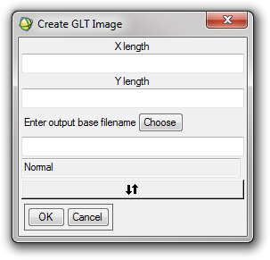

Tools: Misc
-----------

Create GLT file
^^^^^^^^^^^^^^^

Creates an image which can be used as a GLT file for the atmospheric correction software ATCOR. See use cases at the end of this manual for more information. With the default options this routine creates two files as shown below.

**Columns Image**::

	1 2 3 4 5 6 7 8 9 10 ... n
	1 2 3 4 5 6 7 8 9 10 ... n
	1 2 3 4 5 6 7 8 9 10 ... n
	...

**Rows Image**::

	1 1 1 1 1 1 1 1 1 1 ... 1
	2 2 2 2 2 2 2 2 2 2 ... 2
	3 3 3 3 3 3 3 3 3 3 ... 3
	...
	n n n n n n n n n n ... n

The parameters allow the ordering of numbers in the X and Y directions to be reversed (ie. n ... 5 4 3 2 1).

Parameters
..........

* X and Y dimensions of the output image
* Base filename for the output image
* Ordering option

Output
......

Two output files, named with the base filename with ``_RowIndices`` or ``_ColIndices`` appended.

Output band to CSV
^^^^^^^^^^^^^^^^^^

Outputs the selected image band to a CSV file.

Input
.....

Band of an ENVI image file

Parameters
..........

* Filename for the CSV output

Output
......

CSV file containing the DNs from the ENVI image file band