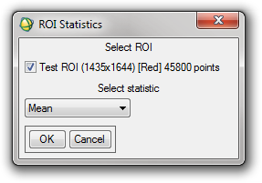

Tools: ROIs
-----------

ROI Percentile Threshold
^^^^^^^^^^^^^^^^^^^^^^^^

Performs similarly to the Band Threshold to ROI function in ENVI, but allows the threshold to be specified as a percentage to be taken from the top or bottom of the range of values. Allows constraints (such as ensuring the resulting values are above zero) to be applied to the pixels selected.

Input
.....
ENVI supported multi-band image

Parameters
..........

* ROI Name
* Percentage - the percentage to be taken from the top or bottom. For example, 0.3 takes the top or bottom 0.3%.
* Top/Bottom – the end of the data from which to take the threshold
* Constraints – No constraint, Ensure above zero (ensures that all resulting pixels have values greater than zero), Ensure below zero (ensures that all resulting pixels have values less than zero).

Output
......

ROI containing all the points which satisfy the threshold and the constraints across all bands (ie. not done on each band individually).

Shrink ROIs
^^^^^^^^^^^
Shrinks the selected ROIs by one pixel around their perimeter. NB: This routine creates new ROIs and does not overwrite the old ROIs.

Input
.....

One or more ROIs

Output
......

The same number of ROIs selected as input, each shrunk by one pixel around their circumference.

Translate ROIs
^^^^^^^^^^^^^^
Translates the selected ROIs by the given X and Y distances. NB: This routine creates new ROIs and does not overwrite the old ROIs.

Input
.....

One or more ROIs

Parameters
..........

* X translation distance
* Y translation distance

Output
......

The same number of ROIs selected as input, each translated by the distances given.

ROI Statistics
^^^^^^^^^^^^^^
Calculates statistics such as sum, mean and max on the data covered by a ROI.

Input
.....

One or more ROIs attached to an image

Parameters
..........

* Statistic to calculate, from the following list:
  * Sum
  * Mean
  * Median
  * Standard Deviation
  * Minimum
  * Maximum

Output
......

Results of the statistics presented in onscreen in text format.
